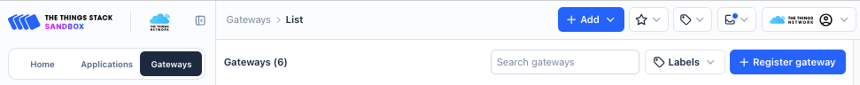
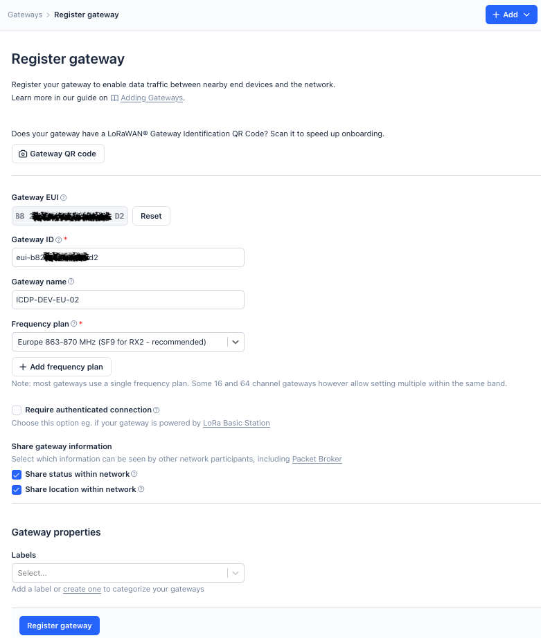

# Adding a Gateway to the Things Network (TTN)
[←Top](../README.md) 
The below describes how to add a LoRaWAN Gateway to The Things Network (TTN) 
These instructions assume
- You have an account with TTN.
- You know how to login and access the US or EU consoles.

TTN Consoles https://console.cloud.thethings.network/
- Regions
  - EU  https://eu1.cloud.thethings.network/console
  - US  https://nam1.cloud.thethings.network/console
  - AS  https://au1.cloud.thethings.network/console

Login to TTN. Go to the console region. Select the Gateways button. Select the "Register gateway" button. 
 

Obtain the following from your gateway.
- Gateway EUI 
  - Note: Not all gateways come with a factory-preprogrammed Gateway EUI like some commercial gateways. In this case us the Gateway ID
- Gateway ID
  - Note: In the TTN form enter eui- followed by the gateway ID converted to lower case.
- Frequency plan
  - Europe 863-870 MHz (SF9 for RX2 - recommended)
  - United States 902-928 MHz, FSB 2 (used by TTN)
  - Australia 915-928 MHz, FSB 2 (used by TTN)
- Name of the Gateway
  - What is entered at TTN should match the actual gateway name.

 

## Configuring a RAK7246G Development Gateway
- [RAK7246 WisGate Developer D0 Gateway](https://docs.rakwireless.com/product-categories/wisgate/rak7246g/overview)
- [RAK7246G Quick Start Guide](https://docs.rakwireless.com/Product-Categories/WisGate/RAK7246G/Quickstart/#accessing-your-gateway)
- [Connecting Gateway to Cloud Service](https://docs.rakwireless.com/product-categories/wisgate/rak7246g/lorawan-network-server-guide/)

### Local Tweaks

## Configuring a RAK7289 Outdoor LoRaWAN Gateway

=======================================================

At Marshall we deployed a RAK7289 Outdoor LoRaWAN Gateway.

   https://store.rakwireless.com/products/rak7289-8-16-channel-outdoor-lorawan-gateway

We also have a RAK7246G Developer Gateway. Not for outside use. Development.

    https://www.rakwireless.com/en-us/products/lpwan-gateways-and-concentrators/rak7246g

Rakwireless Order
Suspect you will need to purchase via PayPal.

RAK7289V2/RAK7289CV2   8 or 16 channel Outdoor LoRaWAN Gateway
https://store.rakwireless.com/products/rak7289-8-16-channel-outdoor-lorawan-gateway?utm_campaign=RAKwireless&utm_medium=WisGate&utm_source=WisGate&variant=42334688149702
QTY 1 @ 372.00

Select 5.8dBi Fiberglass Antenna
N-Type Male / White 902MHz-928MHz
Qty 1 @ $40.00

Note: I believe I have N-connectors and a short cable if we decide to not mount the antenna directly to the gateway.  We may consider this for wind loading reasons. If we install outside the trailer at MFS.

WisGate Developer D0 / D0+
https://store.rakwireless.com/products/rak7246-lpwan-developer-gateway?variant=36313275367582
  RAK7246 / RAK7246G
  WisGate Developer D0+
  Freq US915
Qty 1 @ $114.00

Add Power adapter
Qty 1 @ 5.00
