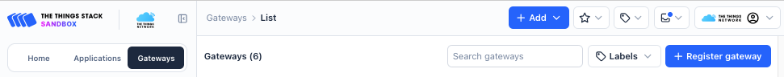
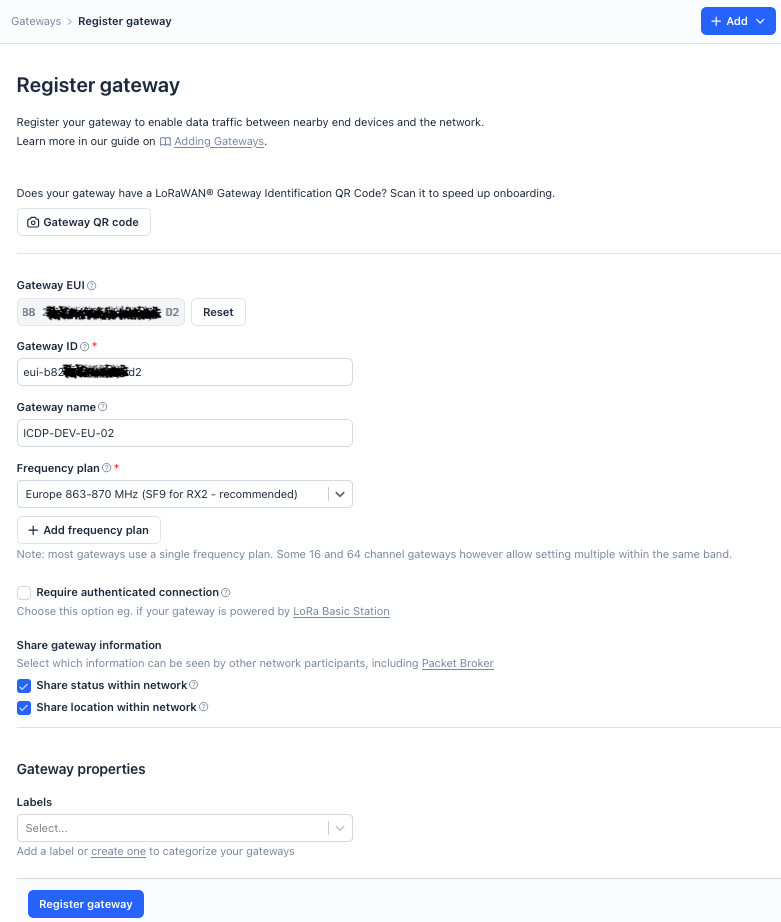
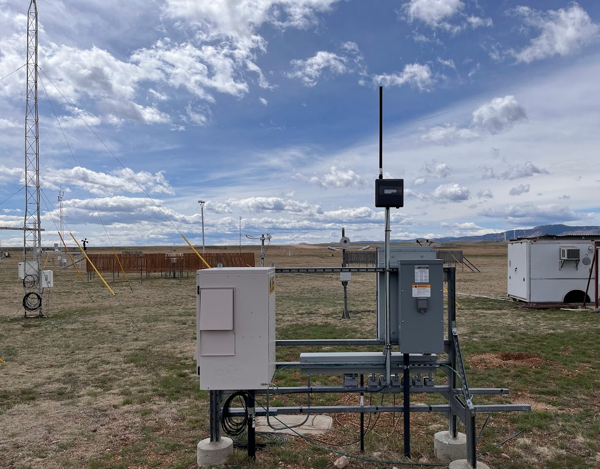
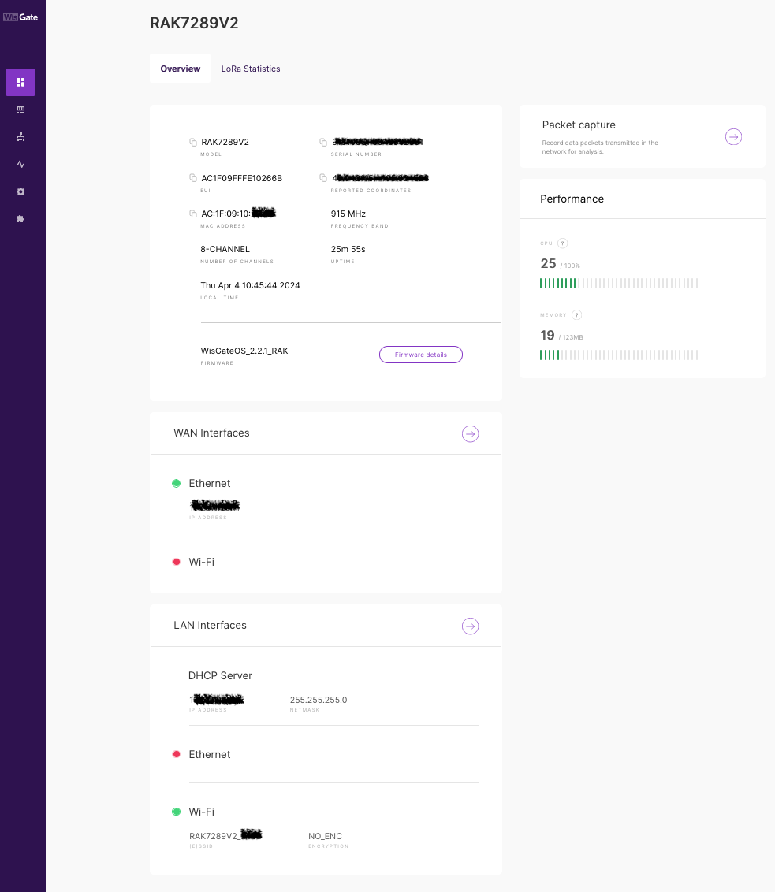
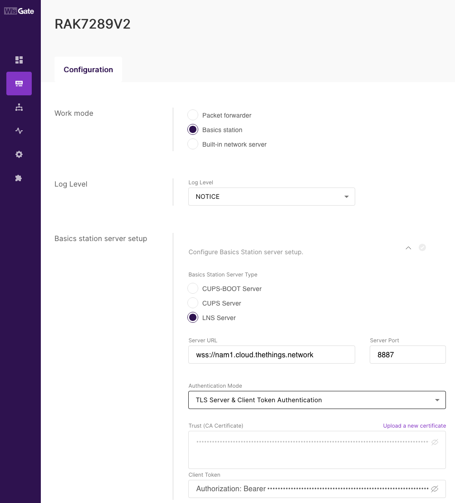
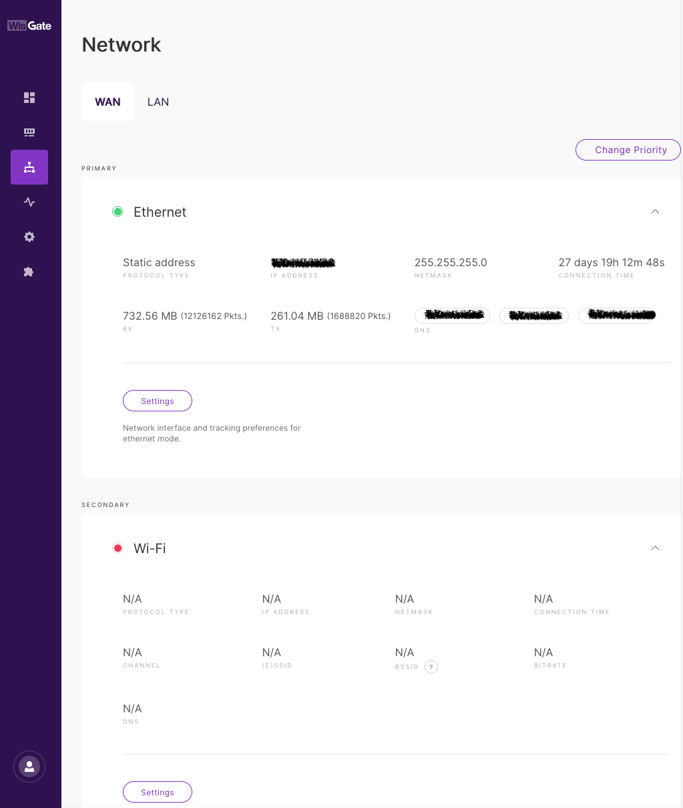
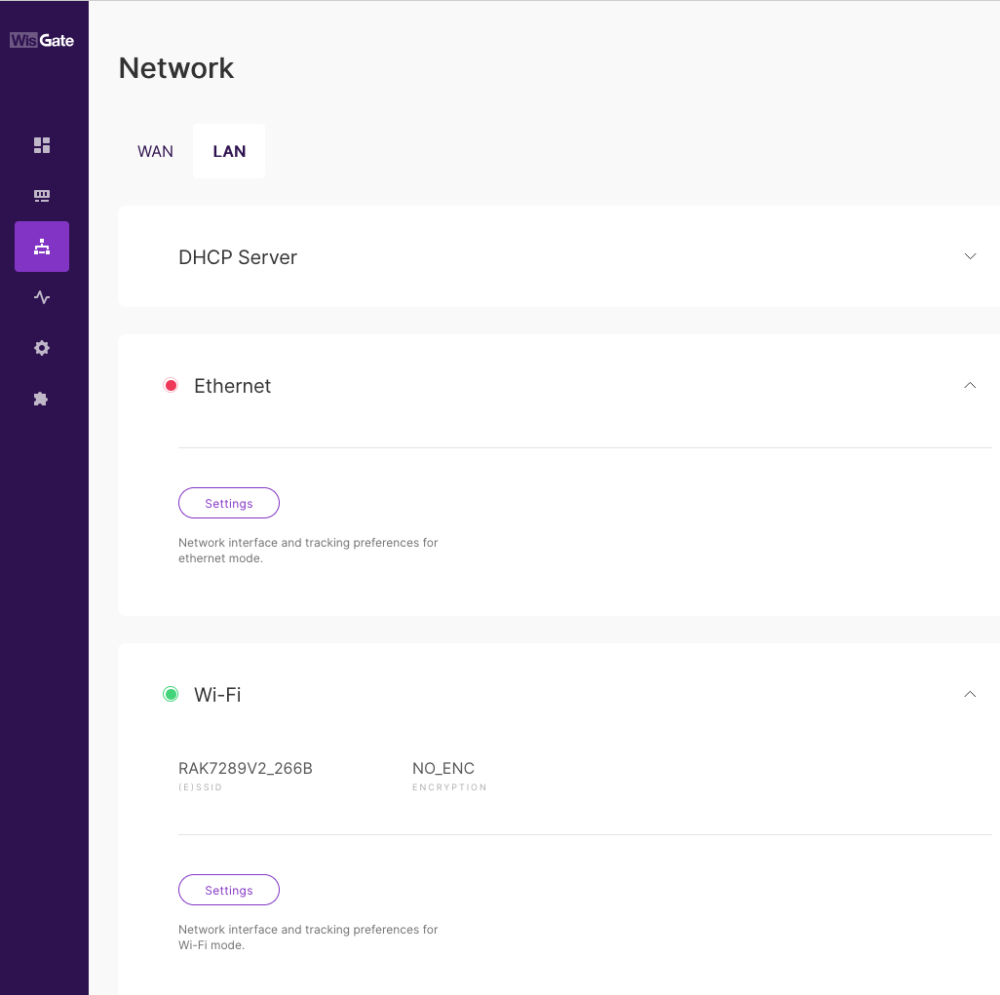
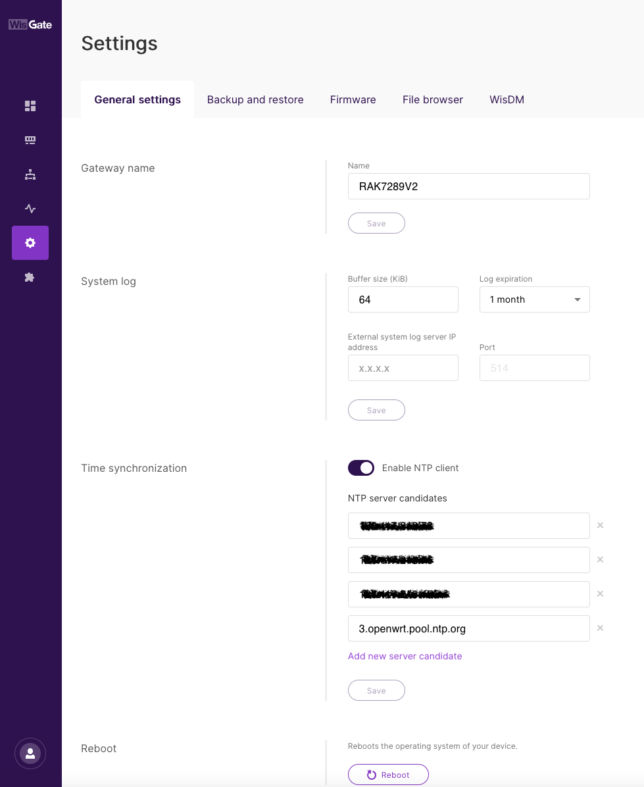

# Adding a Gateway to the Things Network (TTN)
[←Top](../README.md)<BR>
The below describes how to add a LoRaWAN Gateway to The Things Network (TTN)<br>
These instructions assume
- You have an account with TTN.
- You know how to login and access the US or EU consoles.

TTN Consoles https://console.cloud.thethings.network/
- Regions
  - EU  https://eu1.cloud.thethings.network/console
  - US  https://nam1.cloud.thethings.network/console
  - AS  https://au1.cloud.thethings.network/console

Login to TTN. Go to the console region. Select the Gateways button. Select the "Register gateway" button.<br>
<br>

Obtain the following from your gateway.
- Gateway EUI 
  - Note: Not all gateways come with a factory-preprogrammed Gateway EUI like some commercial gateways. In this case us the Gateway ID
- Gateway ID
  - Note: In the TTN form enter eui- followed by the gateway ID converted to lower case.
- Frequency plan
  - Europe 863-870 MHz (SF9 for RX2 - recommended)
  - United States 902-928 MHz, FSB 2 (used by TTN)
  - Australia 915-928 MHz, FSB 2 (used by TTN)
- Name of the Gateway
  - What is entered at TTN should match the actual gateway name.

<br>

## RAK7246G Development Gateway Deployment

When purchasing a RAK gateway, purchase one that if for the region (US, EU, AU) it will be operating in.

- [RAK7246 WisGate Developer D0 Gateway](https://docs.rakwireless.com/product-categories/wisgate/rak7246g/overview)
  - Add power adaptor when ordering.
- [RAK7246G Quick Start Guide](https://docs.rakwireless.com/Product-Categories/WisGate/RAK7246G/Quickstart/#accessing-your-gateway)
- [Connecting Gateway to Cloud Service](https://docs.rakwireless.com/product-categories/wisgate/rak7246g/lorawan-network-server-guide/)

### Adding Monitor Keyboard and Mouse
Consider purchasing these additional items to be able to access management via attached keyboard and monitor. Normally you ssh to the gateway. But if something goes wroung with the networking this will provide access in.

- [Standard hdmi-a male to mini hdmi-c male cable](https://www.raspberrypi.com/products/standard-hdmi-a-male-to-mini-hdmi-c-male-cable/)
- [Micro USB OTG to Ethernet Adapter with Powered Hub - Compatible with Raspberry Pi Zero](https://www.amazon.com/Smays-Ethernet-compatible-Raspbian-Raspberry/dp/B00L32UUJK/ref=sr_1_1?crid=3BIAQG7FVLPYR)
- Keyboard and Mouse
- Monitor with hdmi input.

If you get no picture on the HDMI do the following.
```
sudo vi /boot/config.txt

# uncomment if you get no picture on HDMI for a default "safe" mode
hdmi_safe=1

reboot
```
With the keyboard, mouse and monitor working you can login and use the "sudo gateway-config" command to configure your networking. With out the fear of shooting your self in the foot and locking the system if you destroyed network access.

Run "sudo raspi-config" to do taks like "Set Location" for time, "Set keyboard" type, and other raspberry pi settings.

Here is where the WiFi SSID and Pre-Shared Key (PSK) aka password is stored "/etc/wpa_supplicant/wpa_supplicant.conf".


## RAK7289 Outdoor LoRaWAN Gateway Deployment

- Equipment
  - When purchasing a RAK gateway, purchase one that if for the region (US, EU, AU) it will be operating in.
  - [WisGate Edge Pro 8- or 16-Channel Outdoor LoRaWAN® Gateway](https://store.rakwireless.com/products/rak7289-8-16-channel-outdoor-lorawan-gateway?utm_campaign=RAKwireless&utm_medium=WisGate&utm_source=WisGate&variant=42334688149702)
    - On the RAK gateway product page there is a tab labeld "WisGate Edge Pr oAccessories". Expand this tab and select the antenna(s) for your region. [5dBi Fiberglass Antenna | Supports 863-870MHz/902-928MHz](https://store.rakwireless.com/products/5dbi-fiber-glass-antenna-supports-863-870mhz)
      - For US select 902-928 MHz
      - For EU select 863–870 MHz
- [RAK7289 Quick Start Guide](https://docs.rakwireless.com/Product-Categories/WisGate/RAK7289/Quickstart)
- [RAK Firmware Download Center](https://downloads.rakwireless.com)

### Setup Notes
The below is from the setup notes that were captured for the NSF/NCAR Marshall Field deployment. These notes have been sanitized for public consumption and may be out of date or inaccurate. This depomyment was our first and only deployment for this gateway.

[NSF/NCAR Marshall Field Test Site LoRaWAN TTN Gateway](https://ral.ucar.edu/projects/marshall-field-site)<br>
  <br>

### Access via Wi-Fi AP Mode
  By default, the gateway will work in Wi-Fi AP Mode, which means that you can find an SSID, named "RAK7289_XXXX" on your PC's Wi-Fi Network List. "XXXX" is the last two bytes of the Gateway MAC address. To access the Web Management Platform, input the following IP Address in your Web browser: 192.168.230.1. Using your preferred Web browser, input the aforementioned IP address and you should see the Login Page. Login with the provided credentials.
  - Username: root
  - Password: root
  The default IP is 169.254.X.X, where the last two segments are mapped from the last four bits of the MAC address of your gateway. For example, the last four bits of the MAC address are 0F:01 and the IP address is 169.254.15.1. Make sure to manually set the address of your PC to one in the same network (for example, 169.254.15.100).

### RAK7289V2 Overview Screen
<br>

### RAK7289V2 Configuration Screen
<br>

### RAK7289V2 Network WAN Screen
<br>

### RAK7289V2 Network LAN Screen
<br>

### RAK7289V2 Settings Screen
<br>

### Register Gateway at TTN
- Follow the instruction at the top of this document. From RAK7289V2 OverviewWeb Page - You will need the EUI. 

### No need to Create an API key at TTN under the Gateway you just created
The RAK 7289V2 is being setup as Basics Station (not Packet Forwarder). This setup uses certificate-based authentication (trust/cert/key files uploaded to WisGateOS on the gateway), which is standard for Basics Station LNS.

### LNS Server Certificate / LNS Trust
- [TTN LoRaWAN Network Server (LNS) Documentation](https://www.thethingsindustries.com/docs/hardware/gateways/concepts/lora-basics-station/lns/)

The LNS server certificate is the [CA certificate](https://en.wikipedia.org/wiki/Certificate_authority) which secures your domain. 
A .pem file containing common certificates is available in the Root Certificates Reference. You will upload the .pem file in your gateway as the LNS Server Certificate, i.e. LNS Trust.

Get From https://www.thethingsindustries.com/docs/reference/root-certificates/
Under the "Let's Encrypt" click on the "here" to download file file.

Save file as:  isrgrootx1.pem

### RAK Gateway Configuration for Basics Station Setup

You will need the TTN Server URL and Port number obtained from TTN for LNS configuration on the gateway.

Select on of the following

| Region/Cluster | LNS WSS URI (port 8887)                     |
| -------------- | ------------------------------------------- |
| EU1            | wss://eu1.cloud.thethings.network:8887      |
| EU2            | wss://eu2.cloud.thethings.network:8887      |
| US             | wss://nam1.cloud.thethings.network:8887     |
| AU             | wss://au1.cloud.thethings.network:8887      |
| AS1            | wss://asia-se1.cloud.thethings.network:8887 |
| JP             | wss://jp1.cloud.thethings.network:8887      |

Upload file isrgrootx1.pem for Trust CA Certificate

Use the API key from above that you kept secure for "Client Token"

See the RAK7289V2 Configuration Screen from above.
