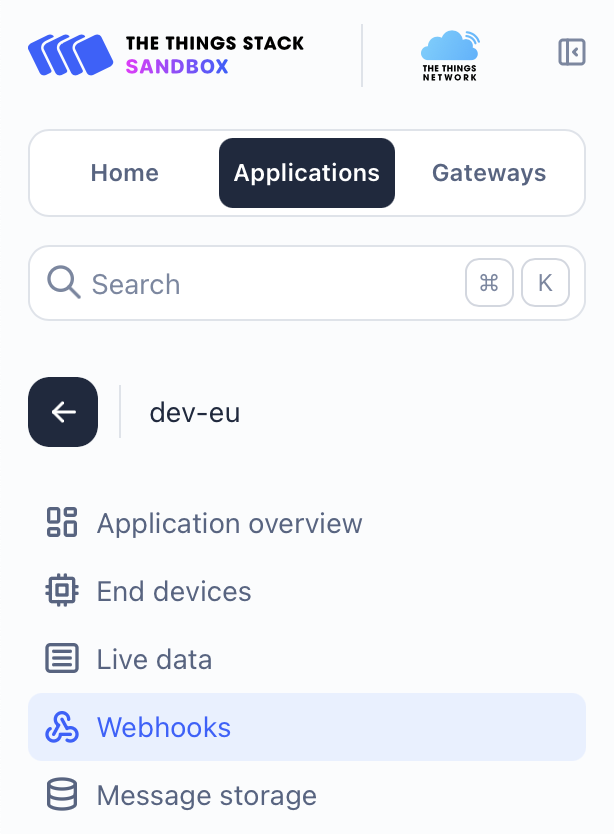
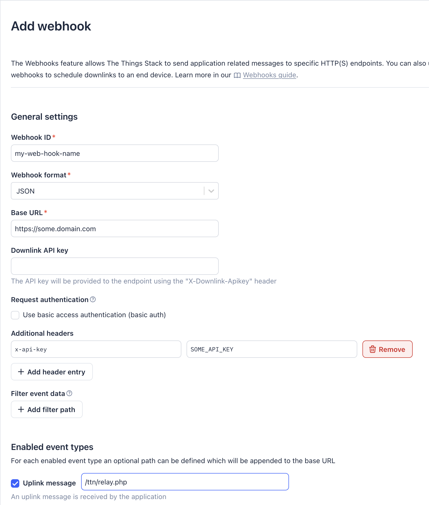

# Adding a Webhook to the Things Network (TTN)
[←Top](../README.md) 
The below describes how to add a Webhook to an Application at The Things Network (TTN) 
These instructions assume
- You have an account with TTN.
- You know how to login and access the US or EU consoles.
- You have an Application already defined at TTN under the console region.

TTN Consoles https://console.cloud.thethings.network/
- Regions
  - EU  https://eu1.cloud.thethings.network/console
  - US  https://nam1.cloud.thethings.network/console
  - AS  https://au1.cloud.thethings.network/console

Login to TTN. Go to the console region. Select the Applications button. Select the your Application from the list. Select Webhooks 
 

Do the following steps.
- Select Add Webhook
- Select "Custom webhook"
- Fill in webhook name
- Fill in Base URL
- Select "Add header entry"
- Fill in header entry with "x-api-key" and API token
- Select Uplink message check box and fill in path to your API
- Select Add webhook

 

