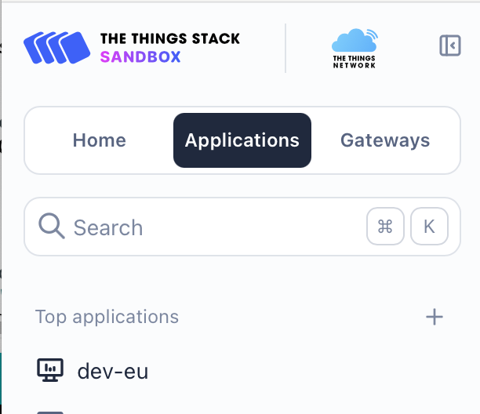
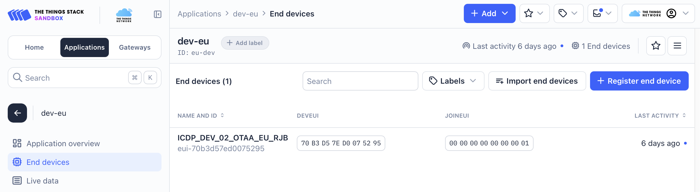
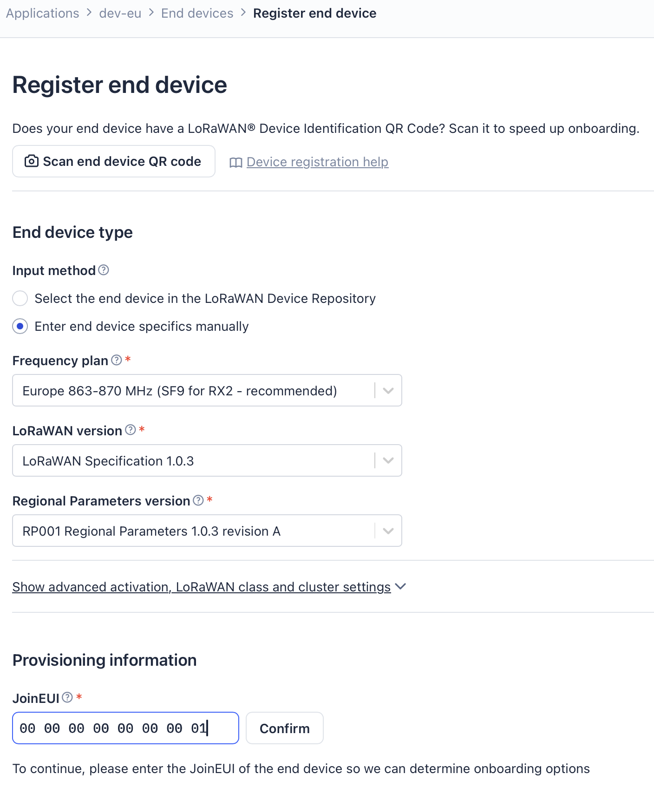
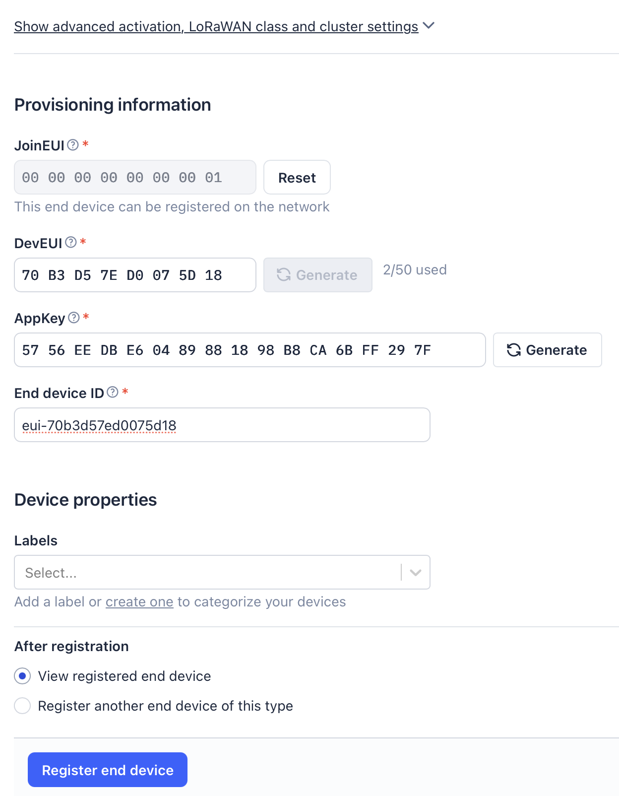

# Connecting a Device to The Things Network (TTN)
[←Top](../README.md)<BR>
The below describes how to connect a Feather Fullstaion LoRaWAN board to The Things Network (TTN)<br>
These instructions assume
- You have an account with TTN.
- You know how to login and access the US or EU consoles.
- You have an Application already defined at TTN under the console region.

TTN Consoles https://console.cloud.thethings.network/
- Regions
  - EU  https://eu1.cloud.thethings.network/console
  - US  https://nam1.cloud.thethings.network/console
  - AS  https://au1.cloud.thethings.network/console

### Over The Air Activation Method.
Connecting to TTN will provide us the 3 required settings for the CONFIG.TXT file.
```
# Note: JoinEUI formally called AppEUI    
# This key is in little endian format      
lw_joineui=

# This key is in little endian format
lw_deveui=

# This key is in big endian format
lw_appkey=
```
Login to TTN. Go to the console region. Select the Applications button. Select the your Application from the list or create a new one.<br>
<br>
Select End Devices and then Select Register end device button.<br>
<br>
The below shows what to select. The JoinEUI can be the same all devices. Select Confirm.<br> 
<br>
TTN enforces that only one end device can be registered per unique DevEUI + JoinEUI combination across tenants. Using the same JoinEUI for multiple devices with distinct DevEUIs allows them to join under that application while avoiding registration conflicts if any device was previously registered elsewhere.<br>
<br>
<br>
After selecting Confirm you will see an new section appear below the above form called "Provisioning information".<br>
- Under DevEUI select Generate
- Under AppKey select Generate
- Under End device ID enter "eui-" followed by the DevEUI converted to lowercase.
- Select Register End Device
<br>

<br>
At this point the device is created. We need to set a End Device Name.<br>
- Select setting in the upper right.
- Under "End Device Name" fill a a device name. This include the site name and occurance number. Also consider adding Join Method (OTAA), Region (US,EU). Perhaps EU_OTAA_SiteName-01. 
- Under End device description, add information that is usefull maintaining this device entry.

<br>

Update CONFIG.TXT file's OTAA section with newly generated TTN device information. Reversing the byte order where required for little endian format.
```
# Note: JoinEUI formally called AppEUI    
# This key is in little endian format 
# 0000000000000001 -> 0100000000000000
lw_joineui=0100000000000000

# This key is in little endian format
# 70B3D57ED0075D18 -> 185D07D05ED3B370
lw_deveui=185D07D05ED3B370

# This key is in big endian format
lw_appkey=5756EEDBE60489881898B8CA6BFF297F
```