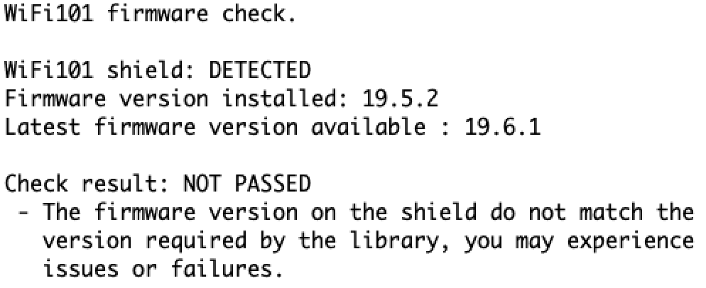
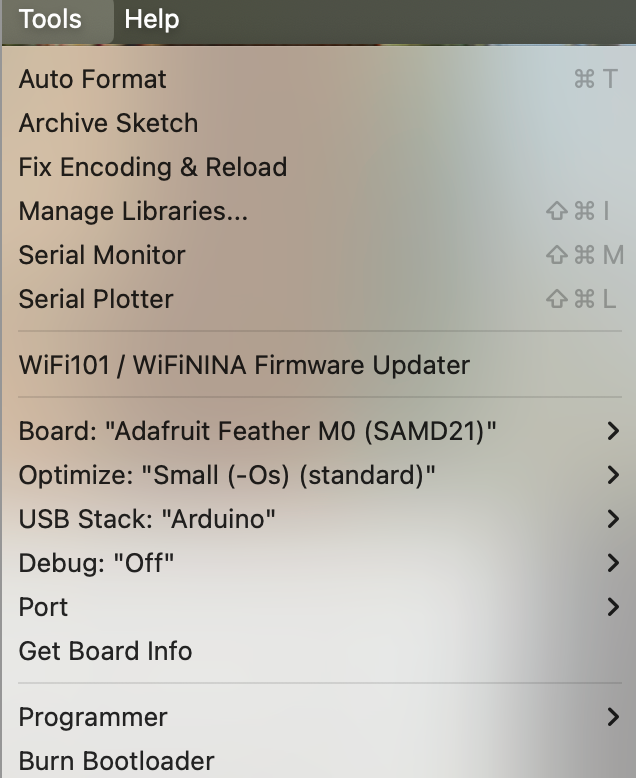
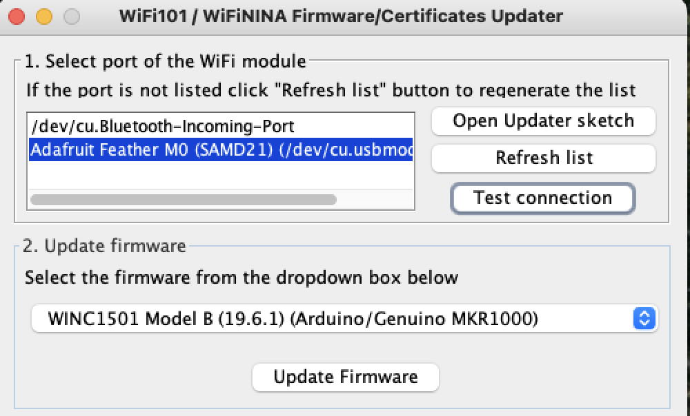
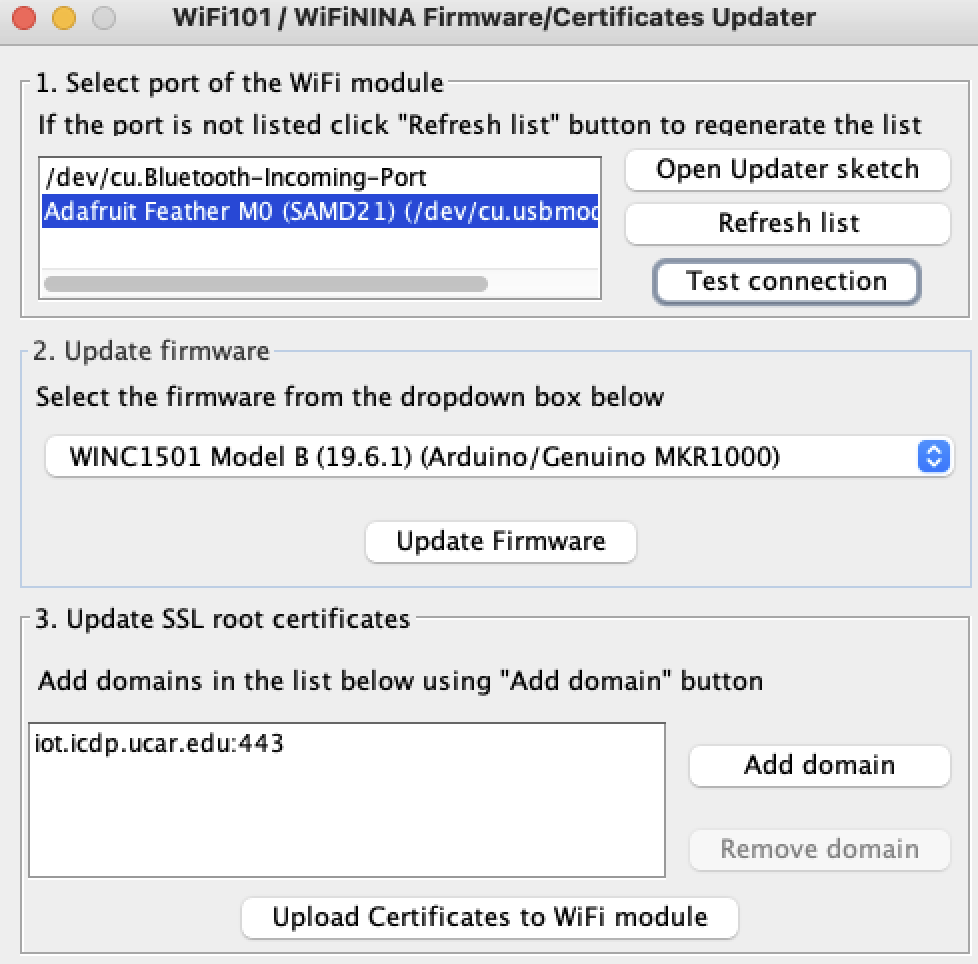

# WiFi Board Preparation
[←Top](../README.md) 

### Updating to the latest WiFi WINC1500 firmware Version
There are a couple ways of doing this. 
- Choice 1
  - Download the Feather Full Station code to the board. Enable Serial Monitor and look for output "WiFi FW: 19.5.2"
- Choice 2
  - Use the Arduino WiFi101 provided example program CheckWiFi101FirmwareVersion.
    - In the Arduino IDE, open File → Examples → WiFi101 → CheckWiFi101FirmwareVersion.
    - Add WiFi.setPins(8, 7, 4, 2) in the Setup() function in the code ide window.\
    - Download and run 
    

### Update the WINC1500 firmware (if needed)
- First we need to install FirmwareUpdater application on the feather WiFi board. This is so the Updater can speak to the Feather M0 WiFi board and upload firmware to the radio.
  - In the Arduino IDE, open File → Examples → WiFi101 → FirmwareUpdater 
  - Connect the Feather WiFi board to your computer's usb.
  - Add WiFi.setPins(8, 7, 4, 2) in the Setup() function in the code ide window.
- Open WiFi Programmer by selecting Tools → WiFi101 / WiFiNINA Firmware Updater 
  
- In the firmware updater
  - Select the serial port for the Feather WiFi board.
  - Select latest firmware version WINC1501 Model B (19.6.1) (Arduino/Genuino MKR1000). 
  
  - Test the connection. Then select Update Firmware.

### Installing Certificates for HTTPS support
For HTTPS support, a suitable root or site certificate for the domain(s) you connect to; must be downloaded on to the board's WiFi module. The Firmware Updater us used to do ththe download.
- Installing the certificates requires your computer to be connected to the Public Internet. This so the Firmware/Certificates Updater can download the certificate from the Internet before installing.
- Follow the above steps from firmware updating to prepare the Feather M0 WiFi board with FirmwareUpdater application and Preparing the Firmware/Certificates Updater. 
- In the firmware updater under section 3. "Update SSL root certificates"
  - Remove certificate "arduino.io"
  - Select button "Add domain". In the popup type the fully qualified host name of the website you will be sending observations ot onformation messages to.
    - For example: iot.icdp.ucar.edu
    - Repeat the above for additional sites.
  - Select the button "Upload Certificates to WiFi module". 
    

